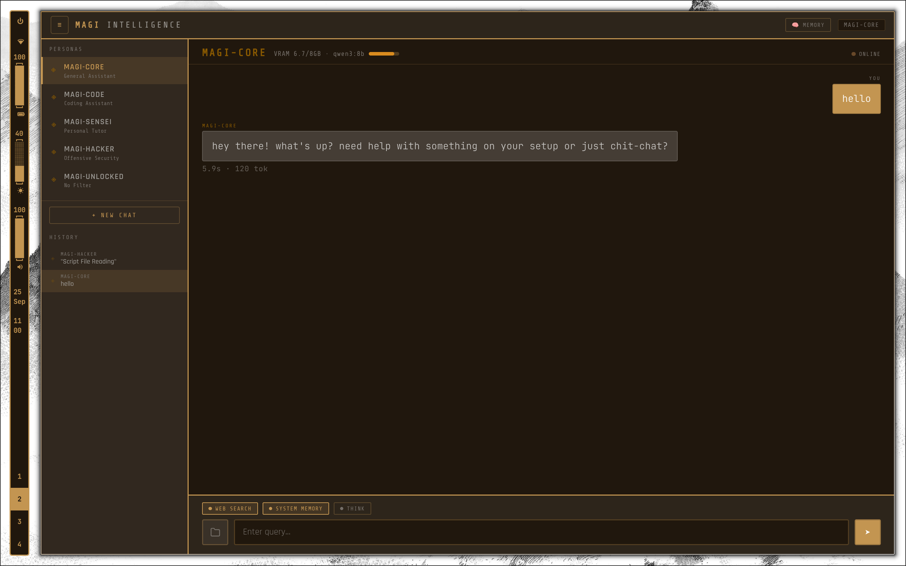
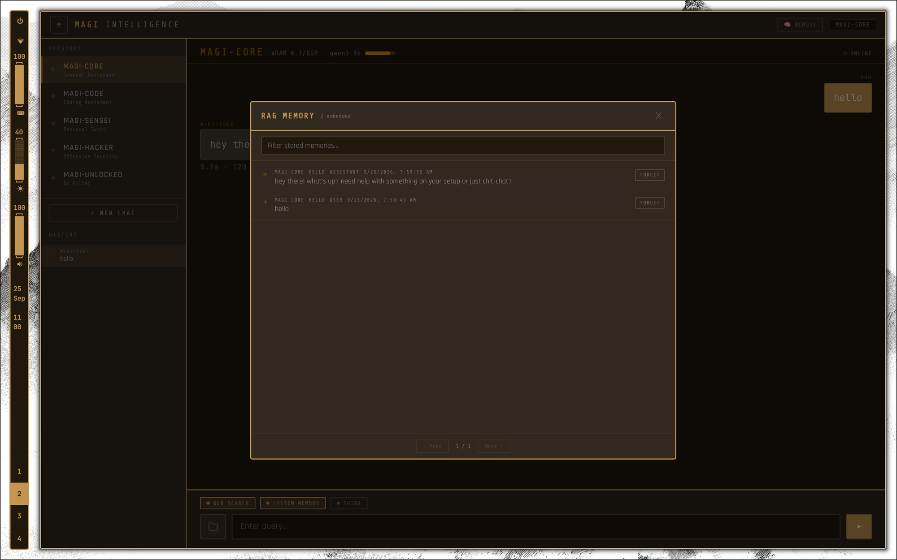
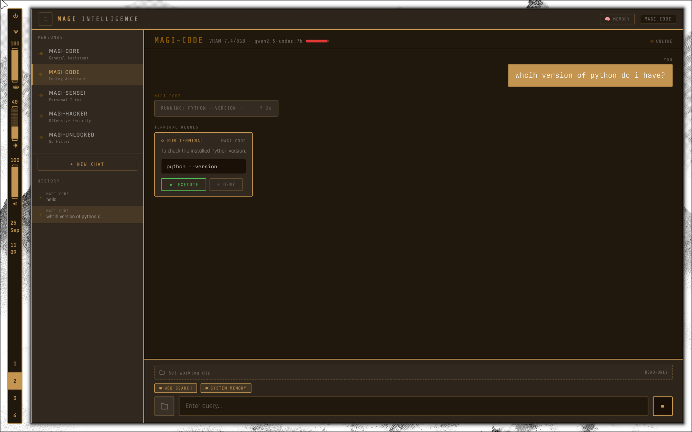
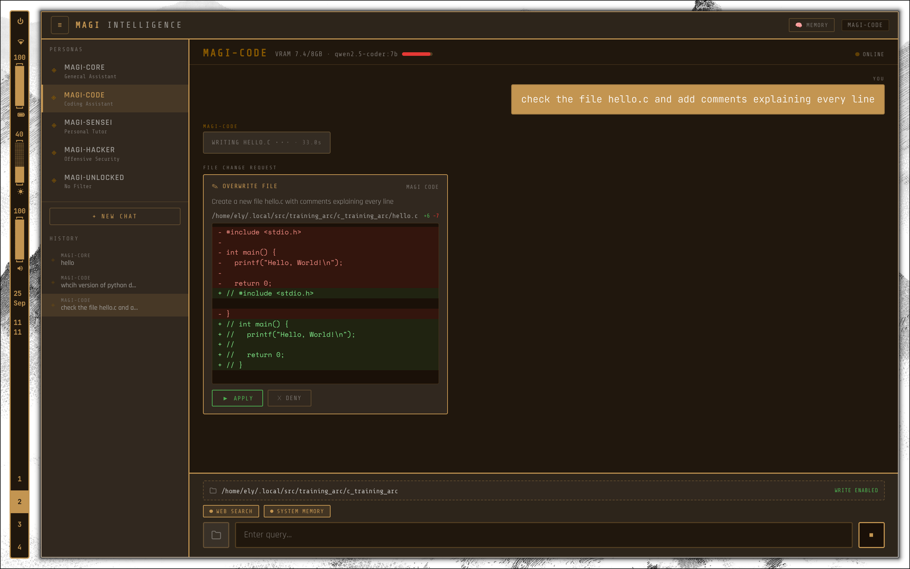
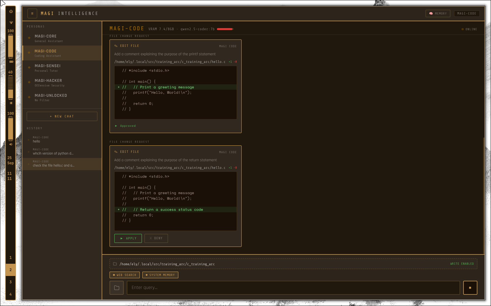

# MAGI

A local, multi-persona LLM assistant built on Electron + Node/Express + MariaDB. Personas run on Ollama models, remember past conversations via RAG (embedding search over chat history), and can search the web through a local SearXNG instance. One persona (`magi-code`) can also read/edit files and run terminal commands in a project directory you set, with every action shown as a diff/command you approve before it touches disk.

## Requirements

- **Node.js** (see `package.json`/Electron 40.x compatibility) and `npm`
- **Docker** + **Docker Compose** (for MariaDB and SearXNG)
- **[Ollama](https://ollama.com)** installed directly on the host (not containerized, for simple GPU passthrough)
- **OS**: developed and tested on Arch Linux + Hyprland. `launch.sh` uses `pgrep`/`kill` (Linux/BSD-style process tools) — Windows users will need WSL or manual equivalents; macOS should mostly work but is untested.
- **Tiling window managers**: `main.js` requests an initial window size (1280x800), but under a tiling WM (Hyprland, i3, sway, etc.) that's just a hint — your WM will tile the window into whatever slot it normally would, ignoring the requested size. This is expected Electron-under-tiling-WM behavior, not a bug.

### VRAM / disk

Ollama loads one persona's model at a time (models swap on demand, not all resident simultaneously), so plan VRAM around your single largest model, not the sum:

| Model | Approx. size |
|---|---|
| `qwen3:8b` | ~5 GB |
| `qwen2.5-coder:7b` | ~4.5 GB |
| `WhiteRabbitNeo/WhiteRabbitNeo-2.5-Qwen-2.5-Coder-7B` | ~4.5 GB |
| `dolphin3:8b` | ~5 GB |
| `nomic-embed-text` (RAG embeddings) | ~275 MB |

8GB+ VRAM comfortably runs any one of these; more lets Ollama keep several resident and avoid reload delays when switching personas. Set `TOTAL_VRAM_GB` in `config.js` to your actual VRAM — it only drives the UI's usage bar, nothing functional.

## Setup

### Installing prerequisites

```bash
# Node.js + npm — via your package manager, or https://nodejs.org
# Arch: sudo pacman -S nodejs npm
# Debian/Ubuntu: sudo apt install nodejs npm

# Docker + Docker Compose — https://docs.docker.com/engine/install/
# Arch: sudo pacman -S docker docker-compose && sudo systemctl enable --now docker
# Debian/Ubuntu: see Docker's official install docs (their repo, not apt's outdated package)
# Either way, add yourself to the docker group so you don't need sudo for docker commands:
sudo usermod -aG docker $USER   # log out/in (or `newgrp docker`) for this to take effect

# Ollama — https://ollama.com
curl -fsSL https://ollama.com/install.sh | sh
```

```bash
# 1. Pull the models each persona uses, plus the RAG embedding model
ollama pull qwen3:8b
ollama pull qwen2.5-coder:7b
ollama pull WhiteRabbitNeo/WhiteRabbitNeo-2.5-Qwen-2.5-Coder-7B
ollama pull dolphin3:8b
ollama pull nomic-embed-text

# 2. Configure the DB password (and, if needed, MAGI_CODE_ROOT)
cp .env.example .env
# edit .env: set MAGI_DB_PASS to something real, and MAGI_CODE_ROOT if your
# projects don't live under ~/.local/src (see .env.example for details)

# 3. Set up your personal prompts dir (gitignored — edit freely, never committed)
cp -r prompts_example prompts

# 4. Bring up MariaDB + SearXNG
docker compose up -d

# 5. Install app dependencies
npm install

# 6. Launch
./launch.sh
```

If a MariaDB/MySQL service is already running on your host and bound to port 3306, stop it first (e.g. `sudo systemctl stop mariadb && sudo systemctl disable mariadb`) so the container can bind that port.

## Personalizing personas

Each persona is defined in two places that must share the same `id`:

- **`config.js`** — `id`, display `name`/`subtitle`/`color`, which Ollama `model` tag it uses, and generation `options` (temperature, context window).
- **`prompts/<id>.md`** — the system prompt: personality, rules, tool-use guidance, and (for `magi-core`) a "System Context" section worth filling in with your actual OS/shell/editor/hardware so answers about your own machine are accurate.

`prompts/` starts as a copy of `prompts_example/` (step 3 above) and is gitignored, so your personalized edits never get committed. To add a new persona, add an entry to `config.js` and a matching `prompts/<new-id>.md`.

`magi-code`'s file tools are sandboxed to `MAGI_CODE_ROOT` (env var, default `~/.local/src`) plus whatever working directory you set per-chat in the UI — set `MAGI_CODE_ROOT` in `.env` if your projects live elsewhere.

## Theming

The UI is themed with CSS variables (`--wal-bg`, `--wal-fg`, `--wal-accent`) defined in `index.html` and derives its whole palette from them via `color-mix()`. If you run [pywal](https://github.com/dylanaraps/pywal), MAGI automatically picks up `~/.cache/wal/colors.json` and re-themes live whenever you rerun `wal`. If you don't use pywal, nothing else is needed — the app just keeps the built-in default palette (warm cream/brown) defined at the top of `index.html`'s `<style>` block. To use your own static palette instead, edit those three `--wal-*` values directly.

## ⚠️ Content warning: `magi-unlocked`

One included persona, `magi-unlocked`, is deliberately built with no refusals or safety guardrails, on the premise that it's a single person talking to a model on their own hardware. It's meant for personal local use only. If you don't want this persona available, delete its entry from `config.js` and remove `prompts/magi-unlocked.md` (and `prompts_example/magi-unlocked.md` in your own fork) before running.

## Demo

**MAGI-CORE** — general chat persona:



**RAG memory** — inspecting embedded conversation history:



**MAGI-CODE** — sandboxed terminal commands require explicit approval:



**MAGI-CODE** — file changes are shown as a diff before anything touches disk:



**MAGI-CODE** — sequential edits, each approved individually:


